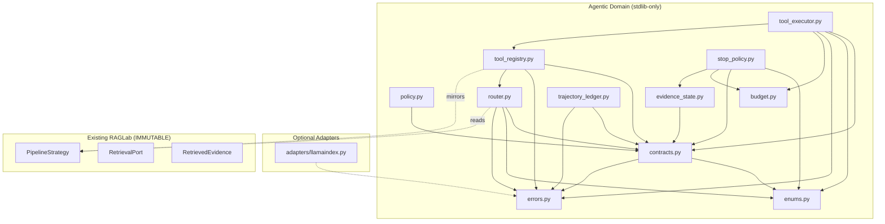

# Slice 5A — Architecture

## Module Dependency Graph

## Design Principles

1. **Domain purity**: No LlamaIndex/Gemini imports in domain modules.
2. **Immutable contracts**: All dataclasses are `frozen=True, slots=True`.
3. **Fail-closed**: Errors raise exceptions, never silently degrade.
4. **Deterministic**: All hashes are SHA-256 over canonical JSON.
5. **Anti-leakage**: qrels, gold answers, holdout detected and rejected.
6. **Budget/Stop separation**: Budget tracks limits; StopPolicy decides.
7. **Append-only ledger**: No rewriting, fsync on every write.

## Separation of Concerns

| Module | Responsibility | What it does NOT do |
|--------|---------------|-------------------|
| `budget.py` | Track resource limits | Decide to stop |
| `stop_policy.py` | Decide to stop | Track resource limits |
| `tool_registry.py` | Catalog available tools | Execute tools |
| `tool_executor.py` | Validate and execute | Register tools |
| `evidence_state.py` | Accumulate and deduplicate | Score or rank |
| `trajectory_ledger.py` | Persist trajectories | Analyze or visualize |
| `router.py` | Classify and select | Execute retrieval |

## Document Filtering Policy (DOCUMENT_FILTERING_DISABLED_V1)

Document, page, and metadata filtering remain strictly disabled in Slice 5A v1 (`_ALLOWED_FILTER_KEYS = frozenset()`).
- No page filters, document filters, or metadata filters are functionally supported or authorized.
- Any tool invocation specifying document filter keys is rejected by structural allowlist validation (`LeakageDetectedError`).
- Contracts preserve argument fields for future compatibility, but functional execution rejects all filters.
