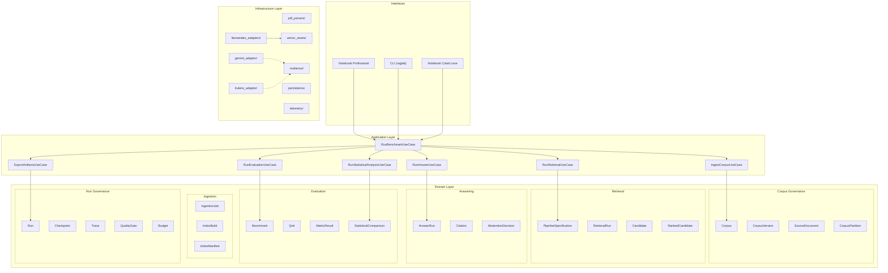

# Pre-Implementation Report — RAGLab v7.0 Evolution

> **Documento autoritativo** — pós-Gate 0, 2026-07-30T15:40 BRT
> **Commits:** `e8d700b` (baseline) + `9d94ca7` (recuperação) + commit documental
> **Status:** Gate 0 encerrado. Slice 1 aguarda autorização.

## 1. Workspace Inventory

| Arquivo | Tamanho | Função |
|---|---|---|
| [L1_Advanced_RAG_Pipeline_Colab_Gemini_Atualizado_v6_1_Recuperacao_Feedback.ipynb](file:///home/leonardomaximinobernardo/Downloads/huggingface_agents_course_bootcamp_AI_triggo_2026/Building_Evaluating_Advanced_RAG/L1_Advanced_RAG_Pipeline_Colab_Gemini_Atualizado_v6_1_Recuperacao_Feedback.ipynb) | 1.000.742 bytes | **V6.1 — arquivo de origem (PROTEGIDO, permanece fora de `raglab-v7/`)** |
| [L1_Advanced_RAG_Pipeline_Colab_Gemini_Atualizado_v6_Checkpoint_Indices.ipynb](file:///home/leonardomaximinobernardo/Downloads/huggingface_agents_course_bootcamp_AI_triggo_2026/Building_Evaluating_Advanced_RAG/L1_Advanced_RAG_Pipeline_Colab_Gemini_Atualizado_v6_Checkpoint_Indices.ipynb) | 102.773 bytes | Versão anterior (v6.0) |
| [L1-Advanced_RAG_Pipeline.ipynb](file:///home/leonardomaximinobernardo/Downloads/huggingface_agents_course_bootcamp_AI_triggo_2026/Building_Evaluating_Advanced_RAG/L1-Advanced_RAG_Pipeline.ipynb) | 12.856 bytes | Notebook original do curso |
| [Building and Evaluating Advanced RAG.pdf](file:///home/leonardomaximinobernardo/Downloads/huggingface_agents_course_bootcamp_AI_triggo_2026/Building_Evaluating_Advanced_RAG/Building%20and%20Evaluating%20Advanced%20RAG.pdf) | 30.876 bytes | Material de referência |
| [L1-Advanced_RAG_Pipeline.pdf](file:///home/leonardomaximinobernardo/Downloads/huggingface_agents_course_bootcamp_AI_triggo_2026/Building_Evaluating_Advanced_RAG/L1-Advanced_RAG_Pipeline.pdf) | 61.476 bytes | Transcrição L1 |
| [L2-RAG_Triad_of_metrics.ipynb](file:///home/leonardomaximinobernardo/Downloads/huggingface_agents_course_bootcamp_AI_triggo_2026/Building_Evaluating_Advanced_RAG/L2-RAG_Triad_of_metrics.ipynb) | 9.155 bytes | Notebook métricas RAG Triad |
| [L2-RAG_Triad_of_metrics.pdf](file:///home/leonardomaximinobernardo/Downloads/huggingface_agents_course_bootcamp_AI_triggo_2026/Building_Evaluating_Advanced_RAG/L2-RAG_Triad_of_metrics.pdf) | 120.454 bytes | Transcrição L2 |
| [L3-Sentence_window_retrieval.ipynb](file:///home/leonardomaximinobernardo/Downloads/huggingface_agents_course_bootcamp_AI_triggo_2026/Building_Evaluating_Advanced_RAG/L3-Sentence_window_retrieval.ipynb) | 21.902 bytes | Notebook sentence-window |
| [L4-Auto-merging_Retrieval.pdf](file:///home/leonardomaximinobernardo/Downloads/huggingface_agents_course_bootcamp_AI_triggo_2026/Building_Evaluating_Advanced_RAG/L4-Auto-merging_Retrieval.pdf) | 75.332 bytes | Transcrição L4 |
| [transcript-L3-Sentence_window_retrieval.pdf](file:///home/leonardomaximinobernardo/Downloads/huggingface_agents_course_bootcamp_AI_triggo_2026/Building_Evaluating_Advanced_RAG/transcript-L3-Sentence_window_retrieval.pdf) | 95.860 bytes | Transcrição L3 |

**Status Git:** Repositório local inicializado. Branch `feat/raglab-v7-evolution`, zero remotos. Commits: `e8d700b`, `9d94ca7`.

---

## 2. Identificação e Integridade da V6.1

| Propriedade | Valor |
|---|---|
| **Arquivo** | `L1_Advanced_RAG_Pipeline_Colab_Gemini_Atualizado_v6_1_Recuperacao_Feedback.ipynb` |
| **SHA-256** | `c11c323e9d5362d4706c3fbbe4b11a107e7c4648407399186aef64fc1fb14db3` |
| **Tamanho** | 1.000.742 bytes |
| **Última modificação** | 2026-07-30 11:40:21 -0300 |
| **Total de células** | 65 |
| **Células de código** | 31 |
| **Células markdown** | 34 |
| **Kernel** | Python 3 |
| **nbformat** | 4.5 |

> [!IMPORTANT]
> O nome real do arquivo **não** contém o sufixo `(1)` mencionado no request.
> O arquivo correto foi identificado e confirmado por hash.

### 2.1 Proteção em Camadas da V6.1

A imutabilidade do original **não** é garantida por `chmod` ou `.gitignore` isoladamente. A proteção é multicamada:

| Camada | Mecanismo | Quem verifica |
|---|---|---|
| L0 — Localização | Notebook original **permanece fora** de `raglab-v7/`, no diretório do workspace original | Humano + CI |
| L1 — Cópia rastreada | Cópia de referência em `raglab-v7/reference/v6_1_reference.ipynb` | Git |
| L2 — Manifesto | `raglab-v7/reference/source_manifest.json` registra 13 campos: `schema_version`, `expected_sha256`, `actual_sha256`, `verified`, `size_bytes`, `original_filename`, `reference_filename`, `captured_at_utc`, `nbformat`, `nbformat_minor`, `total_cells`, `code_cells`, `markdown_cells` (sem caminhos absolutos pessoais) | `scripts/verify_reference.py` |
| L3 — Verificação automática | `scripts/verify_reference.py` (stdlib puro, sem pytest) recalcula hash, tamanho e estrutura do notebook; falha com exit code ≠ 0 | CI + local |
| L4 — Gate CI | Job `preservation-gate` na CI mínima valida L2 + L3 em todo commit | `.github/workflows/ci.yml` |
| L5 — Barreira auxiliar | `chmod 444` na cópia de referência (barreira complementar, **não** garantia) | Filesystem |

**Hash autoritativo:** `c11c323e9d5362d4706c3fbbe4b11a107e7c4648407399186aef64fc1fb14db3`

### 2.2 Preservação Funcional vs. Dívida Técnica

> A v7 preservará integralmente conceitos, contratos, comportamentos,
> resultados, retomada e rastreabilidade da v6.1, mas não copiará código
> morto, células antigas transformadas em strings, duplicações ou
> dependências acidentais do Colab.

**Dívida técnica conhecida da v6.1 (não será importada como código):**

| Item | Célula | Natureza | Tratamento na v7 |
|---|---|---|---|
| DT01 | 49 | Código histórico do judge encapsulado como texto por aspas triplas; não é implementação funcional | Reimplementar como adapter limpo |
| DT02 | 55 | Código histórico do benchmark encapsulado como texto por aspas triplas; não é implementação funcional | Reimplementar como use case |
| DT03 | 54 | Célula monolítica funcional (aproximadamente 986 linhas): rate limit + benchmark + checkpoint + feedback | Decompor em módulos com responsabilidade única |
| DT04 | 54 | Cooldown fixo de 90s hardcoded (`INTER_QUESTION_COOLDOWN_SECONDS`) | Extrair para configuração/política |
| DT05 | 5 | `%pip install` acoplado ao notebook | Manter apenas no Colab leve; núcleo usa `pyproject.toml` |
| DT06 | 11 | `google.colab.drive.mount` como dependência direta | Google Drive passa a ser adapter substituível |
| DT07 | 49, 53, 55 | Células contêm código histórico encapsulado como texto por aspas triplas; não constituem implementação funcional | Não importar; reimplementar comportamentos correspondentes |

> [!NOTE]
> **Células históricas vs. funcionais:** as células 49, 53 e 55 contêm código encapsulado como texto
> (aspas triplas) e não são executáveis. As implementações funcionais correspondentes são:
> cell 48 (judge, 171 linhas) e cell 54 (benchmark, 986 linhas).

Os **conceitos e comportamentos** correspondentes (judge rate-limited, benchmark transacional, checkpoint idempotente, cooldown adaptativo, instalação reproduzível, persistência durável) serão todos preservados e cobertos por testes de regressão.

---

## 3. Inventário Funcional da V6.1

### 3.1 Fundamentos Preservados

| # | Funcionalidade | Célula(s) | Status |
|---|---|---|---|
| F01 | Tabela de correções históricas (v5→v6) | MD 1 | ✅ Documentação |
| F02 | Modelo mental do experimento | MD 2 | ✅ Pedagógico |
| F03 | Contrato de execução e retomada | MD 3 | ✅ Conceitual |
| F04 | Instalação reproduzível `%pip` | CODE 5 | ✅ Operacional |
| F05 | Verificação de ambiente + manifesto de versões | CODE 7 | ✅ Auditável |
| F06 | Credencial segura (Colab userdata) | CODE 9 | ✅ Segurança |
| F07 | `ExperimentConfig` dataclass frozen | CODE 11 | ✅ Reprodutibilidade |
| F08 | `sha256_file`, `canonical_sha256`, `read_envelope` | CODE 11 | ✅ Integridade |
| F09 | `resumable_run_ids()` e validação de retomada | CODE 11 | ✅ Resiliência |
| F10 | `RESUME_RUN_ID` / nova execução | CODE 11 | ✅ Retomada |
| F11 | Google Drive mount + checkpoint persistence | CODE 11 | ✅ Durabilidade |
| F12 | Imports e inicialização LLM/embedding/reranker | CODE 13 | ✅ Backend |
| F13 | Smoke test do Gemini | CODE 15 | ✅ Validação |
| F14 | Upload/seleção do corpus PDF | CODE 17 | ✅ Ingestão |
| F15 | Leitura com proveniência por página | CODE 19 | ✅ Rastreabilidade |
| F16 | Fingerprint SHA-256 do corpus + inspeção | CODE 21 | ✅ Auditabilidade |
| F17 | Benchmark explícito (perguntas inline) | CODE 23 | ✅ Reprodutibilidade |
| F18 | `run_manifest.json` com envelope de integridade SHA-256 | CODE 25 | ✅ Integridade |
| F19 | Checkpoint schema version 3.0 | CODE 25 | ✅ Versionamento |
| F20 | `validate_checkpoint_envelope` | CODE 25 | ✅ Resiliência |
| F21 | `QA_PROMPT` com abstenção e defesa anti-injection | CODE 27 | ✅ Segurança |
| F22 | `source_table()` — proveniência de fontes | CODE 29 | ✅ Rastreabilidade |
| F23 | Pipeline A — Baseline vetorial | CODE 31 | ✅ Retrieval |
| F24 | Pipeline B — Sentence-window + reranking | CODE 35 | ✅ Retrieval |
| F25 | Inspeção mecânica da janela (sem LLM) | CODE 37 | ✅ Pedagógico |
| F26 | Pipeline C — Auto-merging + reranking | CODE 41 | ✅ Retrieval |
| F27 | Hierarquia (2048, 768, 256) tokens | CODE 41 | ✅ Configuração |
| F28 | `PIPELINE_SPECIFICATIONS` DataFrame | CODE 45 | ✅ Rastreabilidade |
| F29 | `GeminiJsonSchemaJudge` — judge rate-limited | CODE 48 | ✅ Resiliência |
| F30 | RAG Triad (Context Relevance, Groundedness, Answer Relevance) | CODE 48 | ✅ Avaliação |
| F31 | `TruLlama` recorders com `app_name`/`app_version` | CODE 50 | ✅ Avaliação |
| F32 | Benchmark transacional com 4 estados por pergunta | CODE 54 | ✅ Resiliência |
| F33 | Rate limit detection + `Retry-After` parsing | CODE 54 | ✅ Resiliência |
| F34 | `retrieve_feedback_results` seletiva | CODE 54 | ✅ Recuperação |
| F35 | Cooldown entre perguntas (90s) | CODE 54 | ✅ Quota |
| F36 | Leaderboard + registros por pergunta | CODE 56 | ✅ Relatório |
| F37 | Exportação de artefatos em `CHECKPOINT_DIR` | CODE 59 | ✅ Persistência |
| F38 | Dashboard opcional (Streamlit) | CODE 61 | ✅ Opcional |
| F39 | Gates finais de integridade (21 gates) | CODE 63 | ✅ Quality gates |
| F40 | Procedimento documentado de retomada | MD 64 | ✅ Operacional |

### 3.2 Funcionalidades Ausentes na V6.1 (a construir)

| # | Lacuna | Prioridade |
|---|---|---|
| G01 | Arquitetura modular (Clean Architecture) | Alta |
| G02 | Ingestão incremental e retomável | Alta |
| G03 | Ground truth independente | Alta |
| G04 | Métricas determinísticas (Recall@k, MRR, nDCG@k) | Alta |
| G05 | Ablação causal (Experimento B) | Alta |
| G06 | Inferência estatística (IC95%, tamanho de efeito) | Alta |
| G07 | Circuit breaker e dead-letter queue | Alta |
| G08 | Fila persistente de tarefas (6 estados) por métrica | Alta |
| G09 | Separação GENERATOR vs JUDGE provider | Alta |
| G10 | Testes automatizados (unitários, integração, property) | Alta |
| G11 | CI/CD pipeline (mínima no Gate 0, incremental) | Alta |
| G12 | Modos de corpus (smoke/controlled/research/stress) | Alta |
| G13 | CLI | Alta |
| G14 | Pacote instalável com lockfile e SBOM | Alta |
| G15 | ADRs, threat model, auditoria de extração | Alta |
| G16 | Retomada idempotente por métrica individual | Alta |

---

## 4. Riscos Identificados

| # | Risco | Impacto | Mitigação |
|---|---|---|---|
| R01 | Corrupção ou perda do v6.1 original | Catastrófico | Proteção em camadas L0-L5 (§2.1); original fora de `raglab-v7/`; `source_manifest.json`; teste automático de hash; gate CI |
| R02 | Ciclo de extração — refatoração muito agressiva quebra funcionalidade | Alto | Vertical slices (§6); TDD por slice; testes de regressão antes de extrair módulo |
| R03 | Dependências do Colab (Drive, userdata) acoplam domínio | Médio | Adapters em `infrastructure/`; ports no `application/`; DT05-DT06 tratados |
| R04 | TruLens API instável entre versões | Médio | Adapter isolado; contract tests; versão pinada no lockfile |
| R05 | Quota Gemini insuficiente para avaliação completa | Alto | Rate limiter central; circuit breaker; fila persistente; modo degradado sem judge |
| R06 | Notebook como artefato de ~1MB dificulta diff | Médio | Lógica em `.py`; notebook orquestra imports |
| R07 | Ground truth manual inexistente para o corpus | Alto | Protocolo de anotação com 2 anotadores, adjudicação e concordância interavaliador (§6.5) |
| R08 | Testes requerem APIs externas | Médio | Mocks para CI; integration tests separados; orçamento de API |
| R09 | ~150 arquivos criados antes da primeira comprovação | Alto | Vertical slices: cada slice é testável e commitável isoladamente |
| R10 | Holdout contamination se corpus não for particionado cedo | Alto | Dois holdouts (query + corpus); split por capítulos; auditoria de duplicação (§6.4) |
| R11 | Supply chain — dependência maliciosa ou vulnerável | Alto | Lockfile com hashes; license scan; vulnerability scan; proibição de `trust_remote_code=True` |

---

## 5. Arquitetura Proposta



### Princípios Arquiteturais

1. **Domain puro**: Nenhuma importação de LlamaIndex, TruLens, Gemini, Colab, Google Drive ou vector store concreto no domínio
2. **Ports & Adapters**: Toda dependência externa via interface (port) no `application/` e implementação em `infrastructure/`
3. **Inversão de dependência**: `infrastructure` depende de `domain`; jamais o contrário
4. **Substituibilidade**: Cada adapter é trocável (ex: Gemini→OpenAI, ChromaDB→Qdrant)
5. **Preservação integral da v6.1**: Toda funcionalidade F01-F40 coberta por teste de regressão

### Estrutura de Diretórios

> [!NOTE]
> A árvore abaixo representa o **estado final planejado**. Os arquivos serão criados
> incrementalmente por vertical slices (§6). O Slice 0 cria apenas o esqueleto
> mínimo marcado com `[S0]`.

```
raglab-v7/                                # Diretório de trabalho (cópia segura)
├── .gitignore                            [S0]
├── .github/
│   └── workflows/
│       └── ci.yml                        [S0] CI mínima (hash + secret scan)
├── .agents/
│   ├── AGENTS.md                         [S0] Regras do workspace
│   ├── rules/                            [S0] Regras persistentes
│   │   ├── preservation.md
│   │   ├── credentials.md
│   │   └── authorization.md              [S0] Regra de autorização
│   ├── skills/                           (planejado — ver §6.7)
│   │   ├── rag-notebook-safety/
│   │   ├── rag-domain-modeling/
│   │   ├── rag-experiment-design/
│   │   ├── rag-evaluation-audit/
│   │   ├── rag-security-review/
│   │   ├── rag-resilience-testing/
│   │   └── rag-release-quality/
│   └── workflows/                        (planejado — ver §6.7)
│       ├── gate-review.md
│       ├── slice-authorization.md
│       ├── incident-recovery.md
│       ├── reproducibility-check.md
│       ├── run-smoke.md
│       └── run-controlled.md
├── reference/
│   ├── v6_1_reference.ipynb              [S0] Cópia rastreada (chmod 444)
│   └── source_manifest.json              [S0] 13 campos, sem caminhos pessoais
├── scripts/
│   ├── verify_reference.py               [S0] Stdlib puro, sem pytest
│   └── scan_secrets.py                   [S0] Stdlib puro, sem dependências
├── gate0_report.md                       [S0] Relatório do Gate 0
├── specs/                                [S0] Esqueleto; conteúdo no Slice 1+
│   ├── system_spec.md
│   ├── corpus_spec.md
│   ├── ingestion_spec.md
│   ├── retrieval_spec.md
│   ├── evaluation_spec.md
│   ├── checkpoint_spec.md
│   ├── quota_resilience_spec.md
│   ├── security_spec.md
│   ├── statistical_analysis_spec.md
│   └── acceptance_criteria.md
├── governance/
│   ├── experiment_spec.yaml
│   ├── hypotheses.yaml
│   ├── analysis_plan.md
│   ├── exclusion_policy.yaml
│   ├── budget.yaml
│   ├── threat_model.md
│   ├── model_manifest.json
│   ├── dataset_manifest.json
│   ├── question_manifest.json
│   └── claims_policy.yaml
├── adrs/
│   └── 001-evolution-from-v6.1.md
├── src/raglab/
│   ├── __init__.py
│   ├── domain/
│   │   ├── __init__.py
│   │   ├── entities/
│   │   │   ├── __init__.py
│   │   │   ├── corpus.py
│   │   │   ├── ingestion.py
│   │   │   ├── retrieval.py
│   │   │   ├── answering.py
│   │   │   ├── evaluation.py
│   │   │   └── run_governance.py
│   │   ├── value_objects/
│   │   │   ├── __init__.py
│   │   │   ├── identifiers.py
│   │   │   ├── fingerprints.py
│   │   │   ├── scores.py
│   │   │   └── envelopes.py
│   │   ├── policies/
│   │   │   ├── __init__.py
│   │   │   ├── abstention_policy.py
│   │   │   ├── checkpoint_policy.py
│   │   │   ├── claims_policy.py
│   │   │   ├── deduplication_policy.py
│   │   │   └── split_integrity_policy.py
│   │   └── services/
│   │       ├── __init__.py
│   │       ├── corpus_integrity_service.py
│   │       ├── statistical_analysis_service.py
│   │       └── quality_gate_service.py
│   ├── application/
│   │   ├── __init__.py
│   │   ├── use_cases/
│   │   │   ├── __init__.py
│   │   │   ├── ingest_corpus.py
│   │   │   ├── run_retrieval.py
│   │   │   ├── run_answering.py
│   │   │   ├── run_evaluation.py
│   │   │   ├── run_benchmark.py
│   │   │   ├── run_statistical_analysis.py
│   │   │   └── export_artifacts.py
│   │   └── ports/
│   │       ├── __init__.py
│   │       ├── pdf_parser_port.py
│   │       ├── vector_store_port.py
│   │       ├── llm_port.py
│   │       ├── embedding_port.py
│   │       ├── reranker_port.py
│   │       ├── judge_port.py
│   │       ├── checkpoint_port.py
│   │       └── telemetry_port.py
│   ├── infrastructure/
│   │   ├── __init__.py
│   │   ├── pdf_parsers/
│   │   │   ├── __init__.py
│   │   │   └── llamaindex_pdf_parser.py
│   │   ├── vector_stores/
│   │   │   ├── __init__.py
│   │   │   └── llamaindex_vector_store.py
│   │   ├── llamaindex_adapters/
│   │   │   ├── __init__.py
│   │   │   ├── baseline_adapter.py
│   │   │   ├── sentence_window_adapter.py
│   │   │   └── auto_merging_adapter.py
│   │   ├── gemini_adapter/
│   │   │   ├── __init__.py
│   │   │   ├── gemini_llm.py
│   │   │   └── gemini_judge.py
│   │   ├── trulens_adapter/
│   │   │   ├── __init__.py
│   │   │   └── trulens_evaluator.py
│   │   ├── persistence/
│   │   │   ├── __init__.py
│   │   │   ├── checkpoint_store.py
│   │   │   ├── task_queue.py
│   │   │   └── envelope_store.py
│   │   ├── resilience/
│   │   │   ├── __init__.py
│   │   │   ├── rate_limiter.py
│   │   │   ├── circuit_breaker.py
│   │   │   ├── retry_handler.py
│   │   │   └── quota_budget.py
│   │   └── telemetry/
│   │       ├── __init__.py
│   │       └── structured_logger.py
│   └── interfaces/
│       ├── __init__.py
│       ├── cli/
│       │   ├── __init__.py
│       │   └── main.py
│       ├── notebooks/
│       │   ├── raglab_professional.ipynb
│       │   └── raglab_colab_lite.ipynb
│       └── api/
│           └── __init__.py
├── tests/
│   ├── __init__.py
│   ├── conftest.py
│   ├── unit/
│   │   ├── domain/
│   │   ├── application/
│   │   └── infrastructure/
│   ├── integration/
│   ├── contract/
│   ├── property/
│   ├── regression/
│   │   └── test_v6_1_preservation.py
│   ├── resilience/
│   ├── security/
│   └── golden/
├── benchmarks/
│   ├── questions/
│   ├── qrels/
│   └── ground_truth/
├── corpus/
│   ├── manifests/
│   └── splits/
├── configs/
│   ├── smoke.yaml
│   ├── controlled.yaml
│   ├── research.yaml
│   └── stress.yaml
├── pyproject.toml                        [S0] Metadados, sem dependências pesadas
├── README.md                             [S0]
└── CHANGELOG.md
```

---

## 6. Plano em Vertical Slices

> [!IMPORTANT]
> Cada slice termina com: teste verde, evidência registrada, gate verificado e commit local.
> Nenhum slice subsequente começa sem o gate anterior aprovado.

### Slice 0 — Preservação, Manifesto, Regras e CI Mínima (Gate 0)

| # | Ação | Artefato produzido |
|---|---|---|
| 0.1 | Criar `raglab-v7/` | Diretório vazio |
| 0.2 | Copiar v6.1 como referência | `reference/v6_1_reference.ipynb` (chmod 444) |
| 0.3 | Gerar `source_manifest.json` com 13 campos (`schema_version`, hashes, tamanho, nomes, data UTC, nbformat, contagens de células; sem caminhos absolutos pessoais) | `reference/source_manifest.json` |
| 0.4 | Inicializar Git local **sem remote** | `.git/` |
| 0.5 | Criar branch `feat/raglab-v7-evolution` | Branch local |
| 0.6 | Criar `.gitignore` (excluir `.env`, `*.key`, `__pycache__`, checkpoints) | `.gitignore` |
| 0.7 | Criar `.agents/AGENTS.md` com regras de preservação, credenciais, holdout, ações destrutivas | `.agents/AGENTS.md` |
| 0.8 | Criar `.agents/rules/` com regras persistentes (preservation, credentials, authorization) | `.agents/rules/` |
| 0.9 | Criar `scripts/verify_reference.py` (stdlib puro, sem pytest) que lê manifesto, recalcula hash/tamanho, inspeciona JSON do notebook, valida todos os campos estruturais, usa exit code ≠ 0 em falhas, emite resultado estruturado sem dados sensíveis | `scripts/verify_reference.py` |
| 0.10 | Criar `scripts/scan_secrets.py` (stdlib puro, sem dependências) que verifica padrões de segredos hardcoded, extensões proibidas e marcadores de chave privada | `scripts/scan_secrets.py` |
| 0.11 | Criar CI mínima (`.github/workflows/ci.yml`) que executa `verify_reference.py` e `scan_secrets.py` | CI: hash + secret scan + estrutura |
| 0.12 | Criar esqueleto de `specs/` (arquivos vazios com cabeçalho) | `specs/*.md` |
| 0.13 | Criar `pyproject.toml` mínimo (metadados, sem dependências pesadas) | `pyproject.toml` |
| 0.14 | Commit local | `docs(preservation): register v6.1 reference (SHA-256: c11c323e)` |
| 0.15 | Gerar `gate0_report.md` **dentro de `raglab-v7/`** | `raglab-v7/gate0_report.md` |
| 0.16 | **PARADA**: aguardar autorização humana | — |

**Critérios de saída do Gate 0:**
- ✅ Original intocado (hash idêntico no workspace)
- ✅ Referência com hash validado por `scripts/verify_reference.py`
- ✅ Segredos ausentes validados por `scripts/scan_secrets.py`
- ✅ Repositório local sem remote
- ✅ Nenhuma dependência externa instalada
- ✅ Nenhuma API chamada
- ✅ Nenhum pipeline implementado
- ✅ Commit local realizado
- ✅ `gate0_report.md` produzido **dentro de `raglab-v7/`**
- ✅ Parada para autorização humana

**Estado de verificação (sem falsas alegações):**
```
local_verification:        PASSED | FAILED
secret_scan:               PASSED | FAILED
workflow_syntax:           VALIDATED | NOT_VALIDATED
github_actions_remote_run: NOT_EXECUTED
```

### Slice 1 — Tiny Corpus + Baseline + Checkpoint + Métrica Determinística + CLI (Gate 1)

1. Completar especificações (`specs/`) com Given/When/Then
2. Congelar hipóteses e endpoints primários (`governance/`)
3. Implementar entities e value objects do domínio (corpus, ingestion, run)
4. TDD: teste → implementação → refactor
5. Implementar baseline adapter (LlamaIndex)
6. Implementar checkpoint store e envelope store
7. Implementar CLI mínimo (`raglab smoke`)
8. Implementar Recall@k e MRR determinísticos
9. Executar com tiny corpus (3 perguntas)
10. Evoluir CI para incluir pytest
11. Iniciar controle de supply chain: manifesto de dependências, pinning, lockfile com hashes, verificação de vulnerabilidades
12. Criar threat model inicial
13. **Gate 1**: baseline funciona end-to-end, métrica determinística calculada

### Slice 2 — Sentence-Window + Expansão + Reranking + Evidência Pré/Pós (Gate 2)

1. Implementar sentence-window adapter
2. Implementar reranker adapter
3. Registrar candidatos brutos vs. ranqueados (score, posição, texto)
4. Preservar evidência de expansão por janela
5. Testes de contrato contra comportamento da v6.1
6. **Gate 2**: sentence-window + reranking produzem rastreio completo

### Slice 3 — Auto-Merging + Folhas/Pais + Promoção + Rastreabilidade (Gate 3)

1. Implementar auto-merging adapter
2. Implementar hierarquia folha/pai
3. Registrar pais promovidos, filhos contribuintes, ratio
4. Testes de split integrity (pai não cruza split)
5. Testes de segurança e prompt injection
6. Revisão do threat model após integração dos pipelines e persistência
7. **Gate 3**: três pipelines completos, rastreio causal

### Slice 4 — RAG Triad, Fila Persistente e Modo Degradado (Gate 4-5)

1. Implementar TruLens adapter com separação GENERATOR/JUDGE
2. Implementar fila persistente (6 estados: PENDING, RUNNING, COMPLETE, RETRYABLE, TERMINAL, BLOCKED_BY_QUOTA)
3. Implementar rate limiter central, circuit breaker, dead-letter queue
4. Cada métrica retomável individualmente
5. Modo degradado sem judge
6. Testes de resiliência (quota, interrupção, corrupção)
7. **Gate 4**: segurança verificada
8. **Gate 5**: resiliência comprovada

### Slice 5 — Ablação, Benchmark e Inferência Estatística (Gate 6-8)

1. Implementar Experimento A (pipelines completos) e Experimento B (ablação causal)
2. Implementar métricas de resposta (correção factual, completude, citation precision/recall)
3. Implementar inferência estatística (IC95%, tamanho de efeito, multiplicidade)
4. Implementar tabela de decisão para claims
5. Implementar condições de abstenção
6. Ground truth com protocolo de anotação (§6.5)
7. **Gate 6**: execução completa
8. **Gate 7**: inferência validada
9. **Gate 8**: claims gerados por tabela

### Slice 6 — Notebooks, SBOM e Preparação Operacional

1. Notebook profissional (interface explicativa e auditável)
2. Notebook Colab leve (com `%pip`, Drive mount)
3. ADRs, consolidação e aceite final do threat model, SBOM
4. Relatório experimental e adversarial
5. Runbook
6. Matriz de rastreabilidade final
7. Plano de migração para serviço/API

### 6.1 CI Incremental

A CI evolui com os slices:

| Slice | Adições à CI |
|---|---|
| S0 | `scripts/verify_reference.py` (stdlib), secret scan, estrutura mínima |
| S1 | pytest (unitários), lint (ruff), type check (mypy), tiny-corpus smoke |
| S2 | Contract tests, notebook lint |
| S3 | Testes de prompt injection, split integrity |
| S4 | Testes de resiliência, dependency scan |
| S5 | Benchmark controlado, cobertura, license check |
| S6 | SBOM, build do pacote, validação de manifests |

### 6.2 Desenho Experimental

#### Experimento A — Pipelines Completos

Comparar sistemas implantáveis sob orçamento operacional declarado:
- baseline
- sentence-window + reranking
- auto-merging + reranking

#### Experimento B — Ablação Causal

| Variante | Estratégia de chunking | Expansão/Merging | Reranker |
|---|---|---|---|
| F0 | chunks planos | — | ❌ |
| F1 | chunks planos | — | ✅ |
| S0 | sentenças isoladas | sem expansão | ❌ |
| S1 | sentenças com janela | janela expandida | ❌ |
| S2 | sentenças com janela | janela expandida | ✅ |
| H0 | folhas hierárquicas | sem merging | ❌ |
| H1 | folhas hierárquicas | auto-merging | ❌ |
| H2 | folhas hierárquicas | auto-merging | ✅ |

**Variáveis controladas:** mesmo corpus, mesmas perguntas, mesmo embedding, mesmo LLM, mesmo prompt, mesma temperatura, mesmo top_k inicial (quando aplicável), mesmo limite de tokens, mesma deduplicação, mesmo hardware, mesma política de cache.

**Proibição:** não atribuir ganho à técnica estrutural sem os contrastes F0↔F1, S0↔S1↔S2, H0↔H1↔H2.

#### Conjuntos de Dados Formalizados

| Conjunto | Definição | Objetivo |
|---|---|---|
| `development` | Perguntas e corpus usados para depuração, decisões de design e calibração | Desenvolvimento iterativo |
| `test` | Perguntas sobre corpus conhecido, separadas do development set | Avaliação intermediária controlada |
| `query_holdout` | Perguntas inéditas sobre corpus conhecido, mantidas lacradas | Avaliação confirmatória de generalização |
| `corpus_holdout` | Capítulos/documentos inéditos, ingeridos **somente** após congelamento do protocolo | Avaliar robustez a conteúdo não visto |

**Proibições de holdout:**
- Nenhum tuning após abertura de qualquer holdout
- Nenhuma pergunta parafraseada entre development/test e holdout
- Nenhum corpus_holdout utilizado antes do Gate 6
- Qualquer ajuste realizado após observar o holdout invalida seu caráter confirmatório

### 6.3 Estratégia de Corpus

| Modo | Escopo | Perguntas | Permite claim científico? |
|---|---|---|---|
| `smoke` | 3 perguntas históricas da v6.1 | 3 | ❌ |
| `controlled` | 30–80 páginas, recortes conceituais completos | 40–60 | Parcial (development) |
| `research` | 150–300 páginas, múltiplos documentos, dev+val+holdout | Dimensionado por power analysis | ✅ |
| `stress` | Livro integral (745 páginas) | Ingestão e carga, sem judge integral | ❌ (operacional) |

**Proibições de corpus:**
- ❌ Split por páginas aleatórias
- ❌ Chunk overlap entre splits
- ❌ Sentence-window atravessando splits
- ❌ Pai do auto-merging com filhos de splits diferentes
- ❌ Tratar capítulos do mesmo livro como corpora independentes
- ❌ Declarar validade externa com um único livro

**Níveis de corpus formalizados:**
- **controlado**: recortes conceituais completos do livro (capítulos inteiros)
- **realista**: parte do livro + múltiplos PDFs independentes
- **holdout externo**: documentos/domínios não usados na calibração
- **stress**: livro integral de 745 páginas

**Auditoria de duplicação:** por hash e por similaridade semântica entre splits.

### 6.4 Auditoria Obrigatória de Extração

Antes de qualquer ingestão em modo `controlled` ou superior:

| Dimensão | Verificação |
|---|---|
| Páginas vazias | Detectar e registrar páginas com < N caracteres |
| Caracteres estranhos | Unicode fora do esperado, mojibake, encoding |
| Fórmulas e símbolos | LaTeX, notação matemática, caracteres especiais |
| Ordem de leitura | Colunas, notas de rodapé, boxes |
| Tabelas e figuras | Detectar, registrar, decidir inclusão/exclusão |
| Teorema/demonstração | Identificar blocos estruturados |
| Cabeçalhos e rodapés | Remover repetições sem perder numeração |
| Continuidade entre páginas | Frases e parágrafos cortados no page break |

O relatório de extração (`ExtractionReport`) é pré-requisito do Gate 2.

### 6.5 Protocolo de Ground Truth

> [!WARNING]
> `ground_truth/` não é suficiente por si só. É necessário protocolo completo.

| Componente | Requisito |
|---|---|
| Schema de anotação | Documentado, versionado, aprovado antes da anotação |
| Evidências | Mínimas e alternativas por pergunta (múltiplos passages válidos) |
| Afirmações obrigatórias | Cada resposta decomposta em afirmações atômicas verificáveis |
| Perguntas sem resposta | Incluir perguntas deliberadamente não respondíveis pelo corpus |
| Anotadores | Dois anotadores independentes, com cegamento quanto ao pipeline |
| Adjudicação | Processo definido para resolver discordâncias |
| Concordância interavaliador | Kappa de Cohen ou equivalente, limiar definido na especificação |
| Versionamento | Hash e versão do ground truth registrados no manifesto |

**Proibição:** o agente implementador **não pode** definir sozinho gold labels. Requer revisão humana.

### 6.6 Política de Qualidade de Código

| Métrica | Definição de limiar |
|---|---|
| Cobertura de testes | Proposto na especificação, aprovado antes do Gate 3 |
| Complexidade ciclomática | Proposto na especificação, aprovado antes do Gate 3 |
| Duplicação de código | Proposto na especificação, aprovado antes do Gate 3 |
| Type coverage (mypy) | Proposto na especificação, aprovado antes do Gate 3 |
| Tamanho máximo de funções | Proposto na especificação, aprovado antes do Gate 3 |
| Warnings (compilação/lint) | Proposto na especificação, aprovado antes do Gate 3 |
| Mutation testing | Proposto na especificação, aprovado antes do Gate 5 |
| Vulnerabilidades (safety/pip-audit) | Zero críticas em todo gate |
| Licenças | Compatíveis com o projeto, verificadas por scan |
| Orçamento de dependências | Número máximo e justificativa por dependência |

> [!NOTE]
> Limiares finais **não são inventados neste plano**. Serão propostos na especificação,
> justificados tecnicamente e aprovados por revisão humana antes do Gate 3.

### 6.7 Antigravity: Skills, Rules e Workflows Planejados

Estrutura em `.agents/`:

```
.agents/
├── AGENTS.md                   # Regras globais do workspace
├── rules/                      # Regras persistentes
│   ├── preservation.md
│   ├── credentials.md
│   ├── holdout.md
│   ├── destructive-actions.md
│   ├── dependencies.md
│   ├── commits.md
│   ├── scientific-claims.md
│   └── external-authorization.md
├── skills/                     # Skills focadas
│   ├── rag-notebook-safety/
│   ├── rag-domain-modeling/
│   ├── rag-experiment-design/
│   ├── rag-evaluation-audit/
│   ├── rag-security-review/
│   ├── rag-resilience-testing/
│   └── rag-release-quality/
└── workflows/                  # Workflows como arquivos .md
    ├── gate-review.md
    ├── slice-authorization.md
    ├── incident-recovery.md
    ├── reproducibility-check.md
    ├── run-smoke.md
    └── run-controlled.md
```

> [!NOTE]
> Skills, rules e workflows **não serão criados nesta revisão**. O Slice 0 cria
> apenas `.agents/AGENTS.md` e `.agents/rules/`. Demais elementos são construídos
> nos slices subsequentes à medida que se tornam necessários.

### 6.8 Dependências e Reprodutibilidade

| Requisito | Mecanismo |
|---|---|
| Lockfile | `uv.lock` ou `pip-compile` com hashes |
| Hashes de pacotes | Verificados na instalação (`--require-hashes`) |
| Versão de Python | Declarada em `pyproject.toml`, testada na CI |
| Revisão exata dos modelos | `model_manifest.json` com provider, model_id, versão/checkpoint |
| SBOM | Gerado automaticamente na CI (CycloneDX ou SPDX) |
| License scan | Executado na CI, falha em licenças incompatíveis |
| Vulnerability scan | `pip-audit` ou `safety` na CI |
| `trust_remote_code=True` | **Proibido** sem autorização explícita e ADR |
| Instalação inferida | **Proibido** instalar pacote a partir de exceção de import |

---

## 7. Arquivos Criados ou Modificados

### Arquivos por Slice

| Slice | Arquivos | Exemplos-chave |
|---|---|---|
| S0 | 23 (observado via `git ls-files`) | `source_manifest.json`, `verify_reference.py`, `scan_secrets.py`, `ci.yml`, `authorization.md`, `gate0_report.md` |
| S1 | ~20 | Entities, value objects, baseline adapter, CLI, `Recall@k`, specs completas |
| S2 | ~8 | Sentence-window adapter, reranker adapter, contract tests |
| S3 | ~8 | Auto-merging adapter, split integrity, prompt injection tests |
| S4 | ~12 | TruLens adapter, fila persistente, circuit breaker, rate limiter |
| S5 | ~10 | Ablação, benchmark, inferência estatística, claims policy |
| S6 | ~8 | Notebooks, SBOM, threat model, runbook |

### Arquivos MODIFICADOS

| Arquivo | Natureza da modificação |
|---|---|
| **NENHUM arquivo original** | A v6.1 e todos os notebooks originais permanecem intocados |

> [!CAUTION]
> O notebook v6.1 original **nunca será modificado**. Permanece fora de `raglab-v7/`.
> Toda evolução ocorre exclusivamente dentro de `raglab-v7/`.

---

## 8. Comandos Pretendidos

### Slice 0 — Preparação (únicos comandos autorizáveis agora)
```bash
# 1. Criar diretório de trabalho
mkdir -p raglab-v7/reference raglab-v7/scripts

# 2. Copiar v6.1 como referência rastreada
cp "L1_Advanced_RAG_Pipeline_Colab_Gemini_Atualizado_v6_1_Recuperacao_Feedback.ipynb" \
   raglab-v7/reference/v6_1_reference.ipynb
chmod 444 raglab-v7/reference/v6_1_reference.ipynb

# 3. Gerar source_manifest.json com 13 campos (script inline, stdlib puro)
python3 -c "
import json, hashlib, os
from datetime import datetime, timezone
path = 'raglab-v7/reference/v6_1_reference.ipynb'
with open(path,'rb') as raw: content = raw.read()
h = hashlib.sha256(content).hexdigest()
nb = json.loads(content)
cells = nb.get('cells',[])
manifest = {
    'schema_version': '1.0',
    'expected_sha256': 'c11c323e9d5362d4706c3fbbe4b11a107e7c4648407399186aef64fc1fb14db3',
    'actual_sha256': h,
    'verified': h == 'c11c323e9d5362d4706c3fbbe4b11a107e7c4648407399186aef64fc1fb14db3',
    'size_bytes': os.path.getsize(path),
    'original_filename': 'L1_Advanced_RAG_Pipeline_Colab_Gemini_Atualizado_v6_1_Recuperacao_Feedback.ipynb',
    'reference_filename': 'v6_1_reference.ipynb',
    'captured_at_utc': datetime.now(timezone.utc).isoformat(),
    'nbformat': nb.get('nbformat'),
    'nbformat_minor': nb.get('nbformat_minor'),
    'total_cells': len(cells),
    'code_cells': sum(1 for c in cells if c.get('cell_type')=='code'),
    'markdown_cells': sum(1 for c in cells if c.get('cell_type')=='markdown'),
}
assert manifest['verified'], f'Hash mismatch: {h}'
with open('raglab-v7/reference/source_manifest.json','w') as f:
    json.dump(manifest, f, indent=2, ensure_ascii=False)
print('Manifest OK:', json.dumps(manifest, indent=2))
"

# 4. Criar scripts/verify_reference.py (stdlib puro, sem pytest)
# (conteúdo criado como arquivo, ver implementação)

# 5. Inicializar Git local SEM remote
git -C raglab-v7 init
git -C raglab-v7 checkout -b feat/raglab-v7-evolution

# 6. (após criar .gitignore, .agents/, specs/, ci.yml, pyproject.toml)
git -C raglab-v7 add .
git -C raglab-v7 commit -m "docs(preservation): register v6.1 reference and minimal scaffolding

SHA-256: c11c323e9d5362d4706c3fbbe4b11a107e7c4648407399186aef64fc1fb14db3
Gate 0: preservation + verify_reference.py + rules"
```

### Slices Subsequentes (BLOQUEADOS até autorização por slice)
```bash
# Exemplos — não serão executados sem autorização
python -m pytest tests/ -v --tb=short      # Requer venv + dependências
ruff check src/ tests/                      # Requer ruff instalado
mypy src/raglab/                            # Requer mypy instalado
```

> [!CAUTION]
> **Nenhum** `git push`, `git remote add`, `pip install`, chamada a API ou
> publicação será executado sem autorização explícita.
> **Nenhuma** dependência será instalada no Slice 0.

---

## 9. Decisões que Dependem de Autorização

### 9.1 Executadas no Slice 0

| # | Decisão | Estado |
|---|---|---|
| D01 | Criar diretório `raglab-v7/` no workspace | ✅ Executado — 23 arquivos rastreados |
| D02 | Inicializar Git local **sem remote** | ✅ Executado — commits `e8d700b`, `9d94ca7` |
| D03 | Copiar v6.1 como referência (read-only) em `raglab-v7/reference/` | ✅ Executado — hash verificado |
| D04 | Gerar `source_manifest.json` com 13 campos | ✅ Executado — sem caminhos pessoais |
| D05 | Criar `.agents/AGENTS.md` e `.agents/rules/` | ✅ Executado — 3 regras |
| D06 | Criar CI mínima (`.github/workflows/ci.yml`) | ✅ Executado — 3 jobs |
| D07 | Criar esqueleto de especificações (`specs/`) | ✅ Executado — 10 esqueletos |
| D08 | Commits locais | ✅ Executado — sem push |
| D09 | Gerar `gate0_report.md` dentro de `raglab-v7/` | ✅ Executado |

### 9.2 Bloqueados (requerem autorização futura por slice)

| # | Decisão | Quando |
|---|---|---|
| D10 | Instalar dependências de desenvolvimento (pytest, ruff, mypy) | Slice 1 |
| D11 | Escolha e pinagem do modelo Gemini para generator | Slice 1 |
| D12 | Escolha e pinagem do modelo para judge (independente do generator) | Slice 4 |
| D13 | Formato e conteúdo do ground truth | Slice 5 |
| D14 | Corpus split strategy definitiva | Slice 1 |
| D15 | Margens de equivalência/superioridade para claims | Slice 5 |
| D16 | Limiares de qualidade de código | Pré-Gate 3 |
| D17 | Qualquer `git push`, `git remote add` ou publicação | 🚫 Sempre bloqueado |
| D18 | Instalação de qualquer nova dependência | Por dependência |
| D19 | Acesso a APIs externas (Gemini, HuggingFace) | Por uso |
| D20 | Uso de `trust_remote_code=True` | 🚫 Bloqueado sem ADR |

---

## 10. Matriz de Rastreabilidade (Prévia)

| Requisito | Especificação | Teste | Evidência |
|---|---|---|---|
| Preservação v6.1 | `system_spec.md` §1 | `scripts/verify_reference.py` (S0) → `test_v6_1_preservation.py` (S1+) | SHA-256 match + source_manifest.json (13 campos) |
| Baseline vetorial | `retrieval_spec.md` §1 | `test_baseline_pipeline.py` | Retrieval run |
| Sentence-window | `retrieval_spec.md` §2 | `test_sentence_window.py` | Retrieval run + evidência pré/pós |
| Auto-merging | `retrieval_spec.md` §3 | `test_auto_merging.py` | Retrieval run + promoção |
| Ablação causal | `evaluation_spec.md` §3 | `test_ablation.py` | Matriz F0-H2 completa |
| RAG Triad | `evaluation_spec.md` §1 | `test_rag_triad.py` | Metric results |
| Métricas determinísticas | `evaluation_spec.md` §2 | `test_deterministic_metrics.py` | Recall/MRR/nDCG |
| Inferência estatística | `statistical_analysis_spec.md` | `test_statistical.py` | IC95%, efeito |
| Checkpoint/retomada | `checkpoint_spec.md` | `test_checkpoint.py` | Idempotent restore |
| Resiliência quota | `quota_resilience_spec.md` | `test_quota.py` | Circuit breaker + task queue log |
| Segurança | `security_spec.md` | `test_prompt_injection.py` | Attack suite |
| Claims policy | `governance/claims_policy.yaml` | `test_claims.py` | Decision table |
| Abstenção | `evaluation_spec.md` §5 | `test_abstention.py` | Correct abstentions |
| Separação generator/judge | `security_spec.md` §2 | `test_provider_separation.py` | Configs independentes |
| Extração auditada | `corpus_spec.md` §3 | `test_extraction_audit.py` | ExtractionReport |
| Ground truth protocol | `evaluation_spec.md` §6 | `test_ground_truth_integrity.py` | Concordância interavaliador |

---

## 11. Escopo do Gate 0

> [!IMPORTANT]
> - Nenhuma nova funcionalidade de produto foi implementada no Gate 0.
> - O Gate 0 estabeleceu baseline de preservação, verificação e governança.
> - Os fundamentos funcionais da v6.1 (F01-F40) permanecem preservados e intactos.
> - A migração funcional começa somente após autorização do Slice 1.
> - Este documento é a versão autoritativa única. Não existem versões v2, v2.1, v3 etc.

## Próximo Passo

> [!IMPORTANT]
> Gate 0 **encerrado**. Commits `e8d700b` e `9d94ca7` preservados.
> Parada obrigatória. Slice 1 requer autorização explícita.
